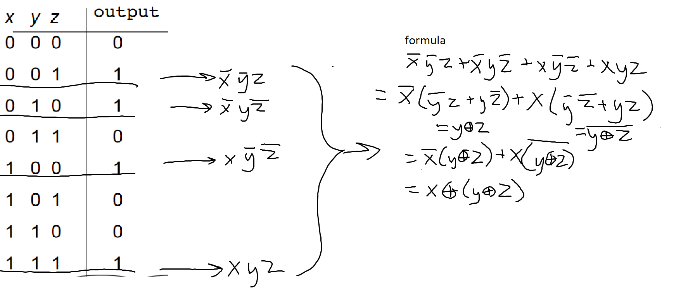

- addition = OR
  - `x + y` = `x OR y`
- multiplication = AND
  - `xy` = `x AND y`
  - `xy(x + y)` = `(x AND y) AND (x OR y)`
- `x̄` = `NOT x` = `!x` = `x'`
  - x̄ seems to be the preferred symbol here
- `x ⊕ y` = `x XOR y`
- N.B.: `ȳ+y` = `True`

parity circuit example:

we'll use the minterm expansion principle (i.e. pull out all the conditions that return 1, OR them, then reduce):



logic & test function example:
```python
def f(x,y,z):
    return (not x and y and not z) or (x and z) # same as !xy!z + xz
def test_function():
    assert f(0,1,0) == 1
    assert f(1,1,0) == 0
    assert f(0,0,0) == 0
```

find the sum of squares of a list with tail recursion.
```py
def sumSq(L, total=0):
    if L == []:
        return total
    else:
        return sumSq(L[1:], total + L[0]**2)
```

memoize the longest common substring problem.
```py
memo = {}
def LCS(S1,S2):
    if (S1,S2) in memo:
        return memo[(S1,S2)]
    elif S1=="" or S2=="":
        result = 0
    elif S1[0] == S2[0]:
        result = 1: LCS(S1[1:],S2[1:])
    else:
        chopS1 = LCS(S1[1:],S2)
        chopS2 = LCS(S1,S2[1:])
        result = max(chopS1,chopS2)
    memo[(S1,S2)] = result
    return result
```


(-28)10 to base 2, using 10 bits and two's compliment:
1. convert abs(n) to binary: (28)10 = (0000011100)2
2. invert all the bits: 1111100011
3. add 1: 1111100100

-11 in 8 bits:
1. (-11)10 = (00001011)2
2. negate 00001011 = 11110100
3. 11110100 + 00000001 = 111101014
4. check:
    ```
       1  1  1  1 0 1 0 1 
    -128 64 32 16 8 4 2 1
    --> base 10: -128+64+32+16+0+4+0+1 = -11
    ```