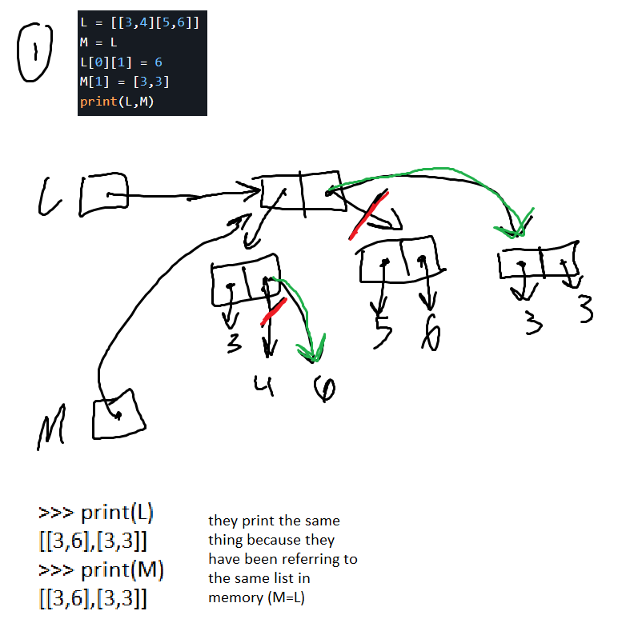
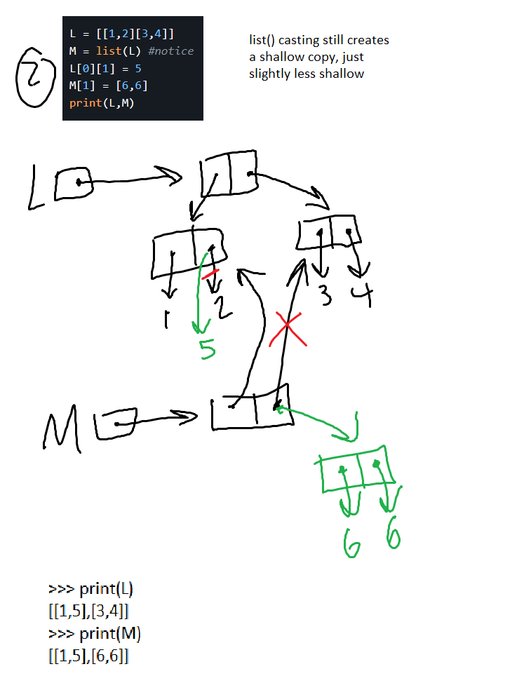

know:
- exceptions
- loop tracing
- box-and-arrow diagrams
- classes and inheritance

# box-and-arrow diagram
```py
L = [[3,4][5,6]]
M = L
L[0][1] = 6
M[1] = [3,3]
print(L,M)
```


```py
L = [[1,2][3,4]]
M = list(L) #notice
L[0][1] = 5
M[1] = [6,6]
print(L,M)
```

- you can do one drawing like this with the crosses OR have one drawing of everything right after being assigned and then what it looks like at the very end
- there will be no deep copy example

# exceptions
```py
try:
    x=23
    print(list(map(lambda y: y+1, x)))
except TypeError:
    print('This is a Type Error')
except ZeroDivisionError:
    print("This is an IO error")
else:
    print('Hello')
finally:
    print('Finally')
print('Done here')
```
```
This is a Type Error
Finally
Done here
```
- `map()` and `list()` need iterables and `x` is not, so it will throw a `TypeError`
- if we removed the `except TypeError` block, it will print `Finally` and throw an error anyway

Errors/Exceptions to know:
- ZeroDivisionError
- NameError
- TypeError
- FileNotFoundError
- IOError
- KeyError
- IndexError
- AssertionError
- RuntimeError
- ValueError
- SyntaxError

# Loop Tracing
```py
i = 4
j = 16
p = []
while i< j:
    i += 1
    total = 0
    for k in range(8,j,2):
        total += k
    p.append(total)
    j -= 2
    # hypothetical print statement that won't
    # be given on the quiz but should be imagined:
    print(i,j,p)
```
| iteration | i | j  | p               |
| --------- | - | -- | --------------- |
| before    | 4 | 16 | []              |
| 0         | 5 | 14 | [44]            |
| 1         | 6 | 12 | [44, 30]        |
| 2         | 7 | 10 | [44, 30, 18]    |
| 3         | 8 | 8  | [44, 30, 18, 8] |

```py
for i in range(10,0,-3):
    j=4
    total = 0
    while j < i:
        j += 1
        total += j
    # hypothetical print statement
    print(i,j,total)
```
| iteration | i  | j  | total |
| --------- | -- | -- | ----- |
| before    | NA | NA | NA    |
| 0         | 10 | 10 | 45    |
| 1         | 7  | 7  | 18    |
| 2         | 4  | 4  | 0     |
| 3         | 1  | 4  | 0     |