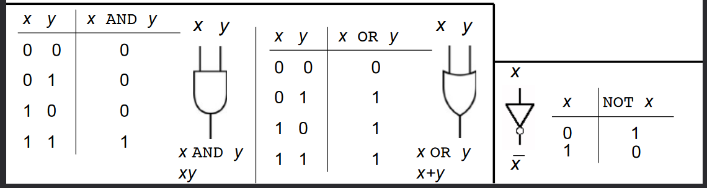
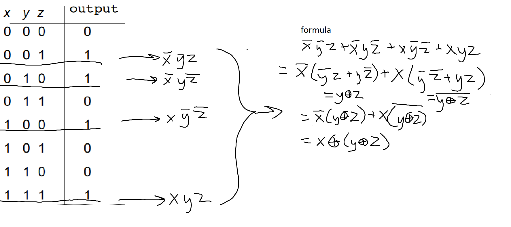
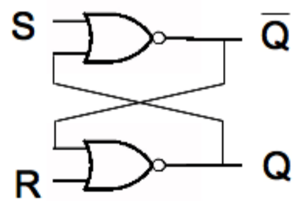
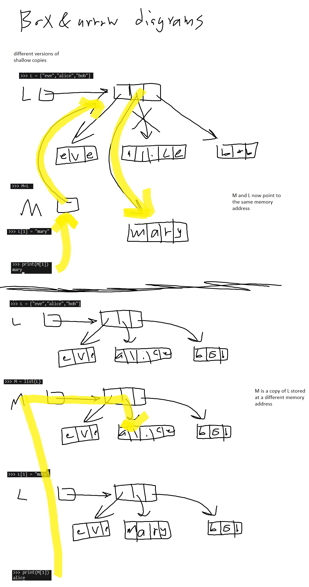
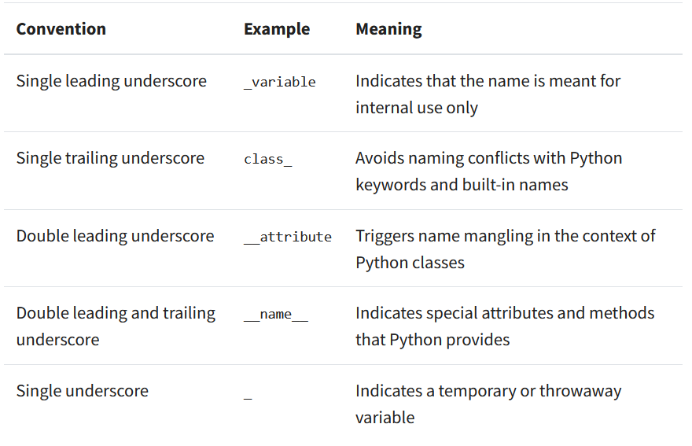

# Bitwise Operations
## Shifting
- helps with space and time efficiency
- more common in C languages
### Left Shifting
we have (42)10 and want to shift it one place *left*
```
 042
<<<
042_

0420
```
multiply by ten and fill remaining digit with 0. this returns 420

---

now we want to left-shift (0011)2:
```
 011        = (3)10
 <<<
011_ 
0110        = (6)10
```
multiply by 2 and fill remaining digit with 0


### Right Shifting
we have (42)10 and want to shift it one place *left*
```
042
>>>
_04
004
```
integer divide by ten and fill remaining digit with 0. this returns 4

---

now we want to right-shift 0101:
```
0101        = (5)10
 >>>
_010
0010        = (2)10
```
integer divide by 10 and fill vacant place with 0.


## Addition
```
10^2_10^1_10^0_
        4    3
+       8    9
=            ?

  (1)  (1)
10^2_10^1_10^0_
        4    3
+       8    9
=  1    3    2

```

```
2^3_2^2_2^1_2^0_
      1   0   1
+     0   1   1
= 1   0   0   0
```
```
2^3_2^2_2^1_2^0_
  0   1   1   1
+ 0   1   1   0
= 1   1   0   1
```
## Multiplication
```
10^5    10^4    10^3    10^2    10^1    10^0
                        3       4       1
*                       1       0       2

=                       6       8       2

                0       0       0
+       3       4       1

=       3       4       7       8       2
```
```
2^5     2^4     2^3    2^2     2^1     2^0
                       1      1       1
*                      1      0       1

=                      1      1       1
                0      0      0
+       1       1      1
= 1     0       0      0      1       1
```


```
2^5     2^4     2^3    2^2    2^1     2^0
                       1      0       1
*                      1      1       0

=                      0      0       0
                1      0      1
+       1       0      1
=       1       1      1      1       0
```

## Russian Peasant Multiplication
- integer divide the first number by 2 until you get to 1 (include the row with 1)
- multiply the second number by 2 the same amount of times
- add together every right value for which the left value is odd    
- sometimes useful to save space while calculating
```
//2      *2
[21  *   6]
 10      12
[5       24] 
 2       48 
[1       96]

6 + 24 + 96 = 126
```

---

in base 2:
- \>\> = shift right = //2
- \>\> = shift left = *2
```
>>           <<
[10101   *       110]
  1010          1100
[  101         11000]
    10        110000
[    1       1100000]

110 + 11000 + 1100000 = 1111110
```

---

back in base 10
```
//2     *2
[33  *   7]
 16     14
  8     28
  4     56
  2    112
[ 1    224]

224 + 7 + 231
```
you could also do this one with the numbers switched for quicker/less computation

having the smaller number in the division column means less steps bc you will reach one quicker

# Representing Negatives in Binary
## Two's Compliment
- easiest way is to just designate the left-most bit to represent the sign.
  - e.g. `0101` = 5 and `1101` = -5
- in this case, though, what do we do with `1000`? is this now "negative" 0? and it's not equal to "positive" 0?
- plus, addition by negative numbers no longer functions the same as subtraction, even though it should
```
   0101                5
+  1101     ==>    + (-5)
= 10010            =   2  ???
  ^ overflow
```
## One's Compliment
- the leftmost bit is still the sign, but now to find the numeric value you have to invert all the bits
- e.g. 
  - `0111` = 7 and `1000` = -7
  - `0011` = 3 and `1100` = -3
- but... we still have positive and negative zeros
  - `0000` = 0, `1111` = -0
- better, but math still doesn't work. everything is 1 less than it should be.
  - pretty easy fix, just add 1 to whatever your solution is.
```
   0101                   5
+  1010         ==>   + (-5)
= 11111               =  -0
  ^ overflow
```
```
   0101                   5
+  1100         ==>   + (-3)
= 10001               =   1
  ^ overflow
```
## Two's Compliment the Right Way
convert -6 to binary as a usable two's compliment number; i.e. (-6)10 = (?)2
```
find positive 6 in binary first:
_ _ _ _  ->  0 1 1 0  =  (6)10
8 4 2 1      8 4 2 1

convert to one's complement:
the original number is negative, so negate all of the bits
0110 -> 1001
the leftmost bit will now be the NEGATIVE 8s place

add 1 to make math work:
1001 + 0001 = 1010

this should be our final answer. check:
 1 0 1 0  -> base 10: -8+0+2+0 = -6 
-8 4 2 1
```
our final answer is (1010)2. this is now usable in math as -6.

---

now find -30 in binary with 6 bits:
```
convert absolute value to binary:
(30)10 = (011110)2

convert to one's compliment (negate all bits)
011110 --> 100001

add 1:
100001 + 000001 = 100010

check:
   1  0 0 0 1 0 --> base 10: -32+2 = -30
 -32 16 8 4 2 1
```

---

-11 in 8 bits:
```
(-11)10 = (00001011)2
negate 00001011 = 11110100
11110100 + 00000001 = 11110101

check:
   1  1  1  1 0 1 0 1 --> base 10: -128+64+32+16+0+4+0+1 = -11
-128 64 32 16 8 4 2 1
```

---

negative 1 in any amount of bits is all 1s, assuming 2's compliment.
- `(111)2` = -1
- `(1111111)2` = -1
- `(11111111)2` = -1

the largest possible number in 2's compliment if we were using 9 bits is 255.
- if we were ignoring the sign bit at the front it would be more.
- however, because we are only using the 8 unsigned bits, 255 is the largest it can hold.

the smallest negative number it can hold is -256

# Computing Digitally
everything you do on a cpu gets converted to binary and has some operation done to it. all of these operations can be described in words, a table, an expression, and a circuit.

## Logic Practice
N.B.

key:
- everything can be written with AND, OR, and/or NOT, it just might be impractical
- addition = OR
  - `x + y` = `x OR y`
- multiplication = AND
  - `xy` = `x AND y`
  - `xy(x + y)` = `(x AND y) AND (x OR y)`
- `x̄` = `NOT x` = `!x` = `x'`
  - x̄ seems to be the preferred symbol here
- `x ↓ y` = `x NOR y`
- `x ⊕ y` = `x XOR y`
  - see below

e.g., xor:
- a function of two binary variables. the output is 1 *iff* exactly one of the inputs is 1.

  | x   | y   | xor(x,y) |
  | --- | --- | -------- |
  | 0   | 0   | 0        |
  | 0   | 1   | 1        |
  | 1   | 0   | 1        |
  | 1   | 1   | 0        |

- formula: `x̄y + xȳ`
- shorthand is ⊕:
  - `x ⊕ y` = `x̄y + xȳ`

NOR gate:
| x   | y   | nor(x,y) |
| --- | --- | -------- |
| 0   | 0   | 1        |
| 0   | 1   | 0        |
| 1   | 0   | 0        |
| 1   | 1   | 0        |

## Odd Parity Circuit
let's try making an odd parity circuit: a function with ***3*** inputs where the output is 1 *iff* the amount of 1s is odd.

we'll use the minterm expansion principle (i.e. pull out all the conditions that return 1, OR them, then reduce):


## Binary Adder
1. take the carry-in (if this is the first bit, it will be 0)
2. perform addition
3. carry out a 1 if necessary, otherwise carry out a 0
4. restart

| x   | y   | carry-in | sum | carry-out |
| --- | --- | -------- | --- | --------- |
| 0   | 0   | 0        | 0   | 0         |
| 0   | 0   | 1        | 1   | 0         |
| 0   | 1   | 0        | 1   | 0         |
| 0   | 1   | 1        | 0   | 1         |
| 1   | 0   | 0        | 1   | 0         |
| 1   | 0   | 1        | 0   | 1         |
| 1   | 1   | 0        | 0   | 1         |
| 1   | 1   | 1        | 1   | 1         |

we can find just the sum using the parity circuit. here's how you find the carry-out: `Cout = xy + Cin(x⊕y)`

## De Morgan's Laws
-  NOT(xy) = x̄ + ȳ
-  x̄ + ȳ = NOT(xy)

you can prove this somehow but who cares

# History of Computing
- starting from the creation of actual computers
- started with electric logic gates
- used to run off small relays
  - a stray moth flying into a relay and breaking it created the term computer bug
- then vacuum tubes
  - whole system weighed 30 tons
  - had to be replaced often
- integrated circuits
  - this is what we use now
  - hard to make

## People
- Alan Turing
  - father of computer science
  - code breaker in WWII
    - created Enigma
- Joan Clarke
  - also did a lot
  - less popular because women were ignored

# One-bit Memory
## SR or RS latch

- this symbol is a NOR gate. it look like an OR gate with the NOT circle after it
- maybe we want to store 1.
  - set S (set bit) to 1 and R (reset bit) to 0
  - Q will equal 1 and be stored, !Q will be reset to 0
  - Q and !Q will always be opposite
## D-Latch
- stops user from pressing both S and R at once
## RAM
- two address bits + 3 data bits + write/read
- 10 110 0 = at the 10th position, write 110
- sends the strobe electricity iff the address is correct
  - strobe takes an AND of the read/write bit and D
  - sends electricity to the D-latch to write at that address
  - works because only one address will be written to because the strobe must be on AND it must be trying to write to the address

# Data Representation
- every variable is stored in a certain location in memory.
  - id(x) gives the memory location of variable x
- every time you change the value of a variable, it is pointed to a new allocation rather than overwriting the old one. e.g.:
```py
>>> x = 2020
>>> y = 'A'
>>> id(x)
2175159779824
>>> x = 42
>>> id(x)
140713400258264
>>> id(y)
140713400318680
>>> y = "B"
>>> id(y)
140713400318728
```
- assigning a variable the value it already has does not change its location:
```py
>>> z="vaccine" 
>>> id(z)       
2175157057840
>>> z="vaccine"
>>> id(z)       
2175157057840
```
---
- assigning a variable with another variable points it to the same memory location:
```py
>>> x = 5
>>> id(x) 
140713400257080
>>> a = x
>>> id(a)  
140713400257080
>>> a == x         
True
>>> id(a) == id(x) 
True
```
---
- if one changes, it will dereference and get a different value
```py
cont.
>>> x=34            
>>> id(x) == id(a) 
False
>>> a = 34
>>> id(x) == id(a)
True
>>> 
```

Lists are mutable. does this change anything?
lists are made up of references to individual values. changing one value (e.g. `w[2]=10`) changes that reference and the id of the list, but not of the other items in the list.

## Box and Arrow Diagrams for Lists



they're both shallow copies but if you do
- M = L
  - then any change to one will reflect in the other
  - because they point to the same memory address
- M = list(L)
  - the changes will not be made to both
  - because they have the same values but are stored in different memory addresses

further example:
```py
L = [[1,2][2,3]]
M = L               # shallow copy

M = list(L)         # deep copy of the top-level list
                    # shallow copy of the inner lists.
                    # still considered shallow.

M = [L[0]*1,L[0]*1] # this is a deep copy. idk why.
```
- there is also a package you can download that automatically deep copies a list for you but we're probably never going to be given it in the class.

# Input-Output
## Getting Input from the User
`input()` is a built-in function
- takes one argument, a string prompt that will print before it starts waiting for input
- returns the user's input as a string
  - if you want something else you will have to typecast that string
  - if you try to typecast the input and the user has typed in the wrong thing it will throw a `ValueError`.
    - in the same way `int("hi")` wouldn't work
    ```
    >>> x = input()
    hi
    >>> y= int(x) 
    Traceback (most recent call last):
      File "<stdin>", line 1, in <module>
    ValueError: invalid literal for int() with base 10: 'hi'
    ```

## File I/O
`open(filename, code)`

`code` can be:
- `w`: write to a file
  - fully destructive. erases the whole original file and writes the new data
- `r`: read from a file
- `a`: append to a file
  - will append if the file exists, otherwise it will create a new one and write to it

[check the docs](https://docs.python.org/3/library/functions.html#open) for more details

### Example: Writing to and Reading from a New File
```py
def write_file(filename,string):
    myfile = open(filename,"w")
    myfile.write(string)
    myfile.close()

def read_file(filename):
    myfile = open(filename, 'r')
    content = myfile.read()
    myfile.close()
    print(content)

filename = "examples.txt"
write_file(filename, "A, B, C")
read_file(filename)
```
this makes a new file `examples.txt` with contents `A, B, C` and then prints those contents to the console.

let's split those singers into a list using `variable.split(separator)` where separator is a string. here it would be a comma.

and we might want to remove any spare spaces with `variable.strip()`. should you need them:
- `.rstrip()` removes from the right
- `.lstrip()` removes from the left

### Possible Reading Functions
```py
# normal reading
def write_file(filename,string):
    myfile = open(filename,"w")
    myfile.write(string)
    myfile.close()

# different reading
def read_file_v2(filename):
    with open(filename, "r") as f:
        return f.read()
    
# store each line as an element in a list; returns that list
def read_file_v3(filename):
    with open(filename, "r") as f:
        return f.readlines()
    
# prints all lines individually and strips them
def read_file_v4(filename):
    with open(filename, "r") as f:
        for line in f:
            print(line.strip())
```

### Other File I/O Function Examples
```py
#Write into a file            
def write_file(string, filename):
    myfile = open(filename, "w")
    myfile.write(string)
    myfile.close()
    
#Append into a file
def append_file(string, filename):
    myfile = open(filename, "a")
    myfile.write(string)
    myfile.close()

def read_preferences(filename):
    dic = {}
    with open(filename, "r") as f:
        for line in f:
            [username, singers] = line.strip().split(":")
            singersList = singers.split(",")
            dic[username] = singersList
    return dic
```
`join(iterable)`: concatenates all of the elements of an iterable into a string
`capitalize(string)`: makes just the first character of the string capital

# Pseudocodes
- middle step from idea to implementation
- designing / validating your algorithm
- describe the distinct steps of an algorithm and how it might work without worrying about syntax
- why?
  - readable
  - easy code construction
  - start point for documentation

# Exceptions
- the program stops when it hits an error
- two errors:
  - syntax error
    - something doesn't make sense
  - exception
    - the code makes sense but something in the code won't let it run
    - doing something you're not allowed to do
- your can raise your own exception:
```py
x = 10
if x > 5:
  raise Exception("x should not exceed 5. Its value is",x)
```
```
Exception: ('x should not exceed 5. Its value is', 10)
```
- assert: does nothing if it receives `True`, otherwise it raises an `AssertionError`
  - you can actually have it give a message if it is false:
```py
assert list == sortedList,"list is not sorted"
```

## Error Handling
- show exceptions without stopping the program with a try-catch block.
```py
try:
  x = 0/0
except ZeroDivisionError as error:
  print(error)
```
- will run the `try` block until it gets an exception
  - if it finds one it moves to `except`
- you need to determine how to handle the error message
- you can specify the error you want to catch or leave it generic
- you can have multiple `except` blocks
- avoid empty `except` clauses
  - just handle the error
- you can have an `else` clause that runs if no exceptions occur
- there can also be a `finally` block that runs no matter what happens
- this will be on test 3

### Try-Catch Example
```py
try:
  z = int(input("Enter a number: "))
  x = y/z
  print(x)
except ZeroDivisionError as error:
  print(error)
except TypeError as err:
  print(err)
except:
  print("Some error happened.")
else: 
  print("x is calculated correctly")
finally:
  print("Done.")
```
---
```
Enter a number: 6
Some error happened.
Done.
```
y doesn't exist so the second line raises a `NameError`, which we don't specify so the generic `except` runs.

---
```
Enter a number: string
Some error happened.
Done.
```
notice this executes the generic `except` block because casting a string to an int raises a `ValueError`, not a `TypeError`

---
```
Enter a number: 0
Some error happened.
Done.
```
this *still* executes the generic except. y still doesn't exist so this raises a `NameError` and NOT the `ZeroDivisionError`.

---
let's fix the code.
```py
try:
  z = int(input("Enter a number: "))
  x = 12/z
  print(x)
except ZeroDivisionError as error:
  print(error)
except TypeError as err:
  print(err)
except:
  print("Some error happened.")
else: 
  print("x is calculated correctly")
finally:
  print("Done.")
```
```
Enter a number: 3
4.0
x is calculated correctly
Done.
```
it runs, in order:
```py
try:
  z = int(input("Enter a number: "))
  x = 12/z
  print(x)
else: 
  print("x is calculated correctly")
finally:
  print("Done.")
```
skipping all of the except blocks because it no longer throws any exceptions.

here's a [list of built-in exceptions](https://docs.python.org/3/library/exceptions.html).

# Loop Tracing

```py
total = 0
for i in range(1,10,3):
  total += i
print(total)
```

| iteration     | i   | total |
| ------------- | --- | ----- |
| initial       | /   | 0     |
| 1st iteration | 1   | 1     |
| 2nd iteration | 4   | 5     |
| 3rd iteration | 7   | 12    |

---

```py
i = 0
count = 3
while i < 15:
  for k in range(5,8): #[5,6,7]. equivalent to count+=18
    count += k
  i += 3
  if i > 10:
    break
```
| iteration     | i   | count |
| ------------- | --- | ----- |
| initial       | 0   | 3     |
| 1st iteration | 3   | 21    |
| 2nd iteration | 6   | 39    |
| 3rd iteration | 9   | 57    |
| 4th iteration | 12  | 75    |

---

```py
i = 0
count = 3
while i < 15:
  for k in range(5,8): #[5,6,7]. equivalent to count+=18
    break  # ADDED THIS LINE
    count += k
  i += 3
  print(i,count)
  if i > 10:
    break
```
| iteration     | i   | count |
| ------------- | --- | ----- |
| initial       | 0   | 3     |
| 1st iteration | 3   | 3     |
| 2nd iteration | 6   | 3     |
| 3rd iteration | 9   | 3     |
| 4th iteration | 12  | 3     |

---

N.B.: string comparisons use ASCII codes, not just letters, so a capital letter will be less than any lowercase letter despite what letter it actually is.

```py
x = list(userPrefs)
def numMatchesFast(userPrefs, storedUserPrefs):
    ''' return the number of elements that match between
        the lists userPrefs and storedUserPrefs. O(nlogn)
    '''
    x = list(userPrefs)
    x.sort()
    y = list(storedUserPrefs)
    y.sort()
    i,j, cnt = 0,0,0
    while i < len(x) and j < len(y):
        if x[i] == y[j]:
            cnt += 1
            i += 1
            j += 1
        elif x[i] > y[j]:
            j += 1
        else:
            i += 1
    return cnt
```
|               | i | j | cnt |
| ------------- | - | - | --- |
| initial       | 0 | 0 | 0   |
| 1st iteration | 1 | 0 | 0   |
| 2nd iteration | 2 | 1 | 1   |
| 3rd iteration | 2 | 2 | 1   |
| 4th iteration | 2 | 3 | 1   |
| 5th iteration | 3 | 4 | 2   |


# Classes
```py
class Rational:
  def __init__(self,n,d):
    if d == 0:
      raise ZeroDivisionError("Denominator cannot be zero!")
    else:
      self.denominator = d
      self.numerator = n
  def isZero(self):
    return self.numerator == 0
  def __add__(self,other):
    newNumerator = self.numerator * other.denominator +\
                   other.numerator * self.denominator
    newDenominator = self.denominator * other.denominator
    return Rational(newNumerator,newDenominator)
  def __ge__(self,other):
    return self.numerator * other.denominator >= self.denominator * other.numerator
  def __eq__(self,other): 
    # checking cross-products
    # even if they are at different levels of simplification this will still work
    return self.numerator * other.denominator == self.denominator * other.numerator
  def __str__(self):
    return str(self.numerator)+" / "+str(self.denominator)
```
- `self.variable`: changes per object in this class
- `variable`: stays the same with every object.
- same with `function(self,arg)` vs `function(arg)`
- when you save a file that only holds a class its file name MUST be the same as the class name
  - for testing purposes, you can make a main() function that runs some functions for you in the class file
    - however you MUST REMOVE IT in your final version (i.e. when you hand it in or use it in another file)
- `__eq__(self,other)` is used for the `==` operator
- `__ge__(self,other)` is used for the `>=` operator
  - you can have any name for the second object
- that escape character `\` in `add()` lets you skip to the next line without the interpreter yelling at you
- class names *should* always start with a capital letter
  - they don't have to, python won't enforce this, but you should

this class in use:
```py
>>> r1 = Rational(1,2) 
>>> r2 = Rational(1,2) 
>>> print(r1.add(r2)) 
4 / 4
>>> print(r1.add(r2) == Rational(1,1)) 
True
```
```py
>>> r1 = Rational(6,1000)      
>>> r2 = Rational(36,1000)  
>>> r1 == r2
False
>>> r2 >= r2 
True
```
```py
>>> r1 = Rational(1,2) 
>>> r2 = Rational(1,2) 
>>> r1 + r2
<__main__.Rational object at 0x000001ED05866450>
>>> print(r1+r2) 
4 / 4
```

## Underscores
- the `__` around some functions are used to overwrite included functions
  - this way you won't do it accidentally
  - these are reserved function names 
    - (even though you can still name a function the words inside)
  - - list of all [dunder methods](https://docs.python.org/3/reference/datamodel.html#special-method-names) from python themselves
- hypothetically if we named a variable in the class `__variable` it is now "private"
  - docs call it name mangling
  - just ignores code outside of the class declaration calling that variable
    - i.e. will not throw an error but will not do anything
  - once you mangle it you have to add accessors/getters (`get_numerator(self)`) and mutators/setters (`set_numerator(self,newN)`) if you want the code to still have access to those things
- a single leading underscore `_name` tells people this is meant for internal use only, but they can access it if they really want to
  - the interpreter is not enforcing it at all because it thinks that's just another character in the name
- a single trailing underscore `name_` lets you use a keyword as a variable name
  - i.e. `str_` or `def_`
- a single underscore in something like a for loop:
  ```py
  for _ in range(5):
    print("Welcome")
  ```
  - shows that the current current iteration does not matter because we won't use it
    - you can still access it if you decide to later but this is just to signal that you aren't using the variable
- putting a single underscore by itself into the interactive shell will reprint the last line the shell output

[source](https://realpython.com/python-double-underscore/#public-interfaces-and-naming-conventions-in-python)


## Inheritance
### Example 1
let's make a general class as a base class or superclass:
```py
class Person:
  def __init__(self, first, last):
    self.firstName = first
    self.lastName = last
  def asleep(self, time)
    return 0<= time <= 7
  def __str__(self):
    return self.firstName + " " + self.lastName

class Student(Person): # shows that Student *is a* subclass of Person
  def __init__(self, first, last, Id):
    Person.__init__(self, first, last)
    # we've never sent self before (only put it as an argument)
    # now we need to because Person's __init__ needs to take the 
    # Student object to work with so it doesn't return a Person
  def asleep(self,time)
    return 0 <= time <= 3
    # you can use the parent class's functions normally OR
    # you can override them like we're doing here
  def __str__(self):
    return Person.__str__(self)+", asleep is "+str(asleep(2))
```
- hypothetically if we remove the `Student` class's `asleep` function, it will fall back on `Person` class's `asleep`.

### Example 2
```py
class Automobile():
  def __init__(self,make,model,price):
    self.__make = make
    self.__model = model
    self.__price = price
  
  def get_make(self):
    return self.make
  def get_model(self):
    return self.model
  def get_price(self):
    return self.price

  def set_make(self, newMake):
    self.__make = newMake
  def set_model(self,newModel)
    self.__model = newModel
  def set_price(self, newPrice):
    self.__price = newPrice

  def __gt__(self,other):
    return self.__price > other.__price
  def __le__(self,other):
    return self.__price <= other.__price

class SUV(Automobile):
  def __init__(self,make,model,price,pass_cap):
    Automobile.__init__(self,make,model,price)
    self.__pass_cap = pass_cap
  def get_pass_cap(self):
    return self.__pass_cap
  def set_pass_cap(self,p):
    self.__pass_cap = p
  def __str__(self):
    return self.__make + " " + self.__model
```

```
>>> civic = Automobile('Honda','Civic',30000)
>>> maserati = Automobile('Maserati','GT'40000)
>>> print(civic)
<__main__ =.Automobile object at 0x000000000>
>>> print(crv)
AttributeError: SUV has no attribute '_SUV__make'
>>> civic > maserati
False
>>> civic <= maserati
True
>>> civic < maserati
True
```
- to fix that error, replace the `self.__make` and `self.__model` calls with `self.get_make()` and `self.get_model()`. `SUV` as a subclass cannot access `Automobile`'s mangled variables
- even though we never gave either class a `__lt__` function, it calls the `Object` comparison function. it's not always right, but it still returns a boolean.